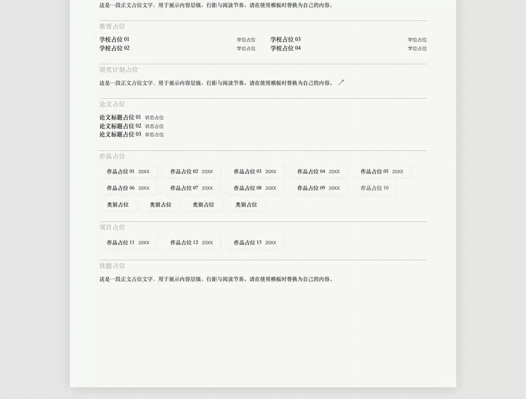
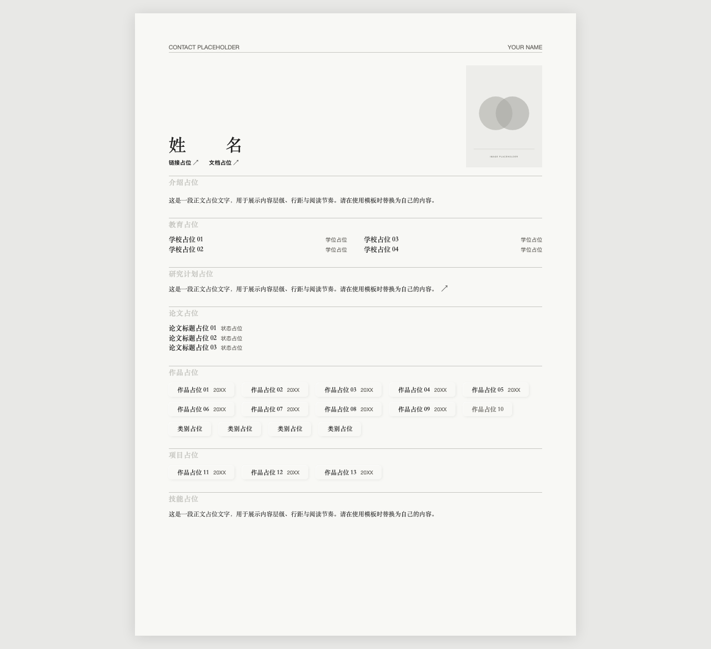

# CV / Portfolio 页面模板

黑白灰、纸张式排版的简历与作品集模板。包含响应式布局、作品展开与收起动画、导航吸顶、学校与论文切换、图片放大以及打印样式。使用原生 HTML、CSS 和 JavaScript，无运行时依赖。

页面中的姓名、联系方式、学校、日期、论文、作品与正文均为占位内容；所有图片均为几何 SVG 占位图。跳转链接、文档按钮、学校内嵌页、论文和研究计划统一打开空白页面。模板不含访问统计或第三方请求。

## 作品展开动画

点击作品标题后，导航重新排列，正文与占位图片平滑展开；收起后回到作品列表。下面的 GIF 录制自模板实际运行效果。



## 页面全览

以下为默认折叠状态的完整页面截图。



## 本地预览

在仓库目录运行：

```sh
python3 -m http.server 8000 --bind 127.0.0.1
```

浏览器打开 `http://127.0.0.1:8000`。无需构建或安装前端依赖。

## 文件结构

```text
index.html                 页面结构与占位文字
styles.css                 排版、响应式、动画与打印样式
script.js                  展开、切换、滚动、吸顶与图片放大
blank.html                 所有链接与文档共用的空白页面
papers/sample.html         保留的旧示例路径，同样为空白页面
assets/*.svg               原创几何占位图
docs/page-overview.png     整页截图
docs/work-interaction.gif  作品展开动画
```

## 替换内容

- 在 `index.html` 中替换占位文字和图片路径，包括 `template` 内的隐藏内容。
- 通过 `href` 和 `data-paper-src` 设置自己的跳转目标；学校内嵌页使用 `iframe` 的 `src`。
- 顶部文档按钮默认打开空白页，可在 `script.js` 中修改 `downloadButton` 的点击处理。
- 保留 `details`、`summary` 和现有类名，让内容继续使用展开、收起及导航动画。
- 发布前自行检查图片授权、个人资料、隐藏属性和文档内容，并重新生成预览图。

仓库未附加开源许可证。
